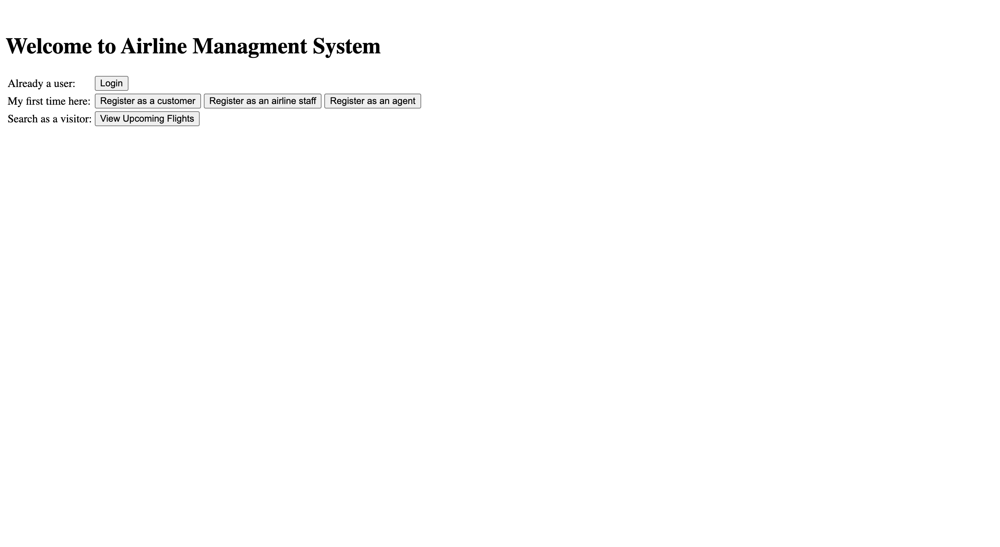
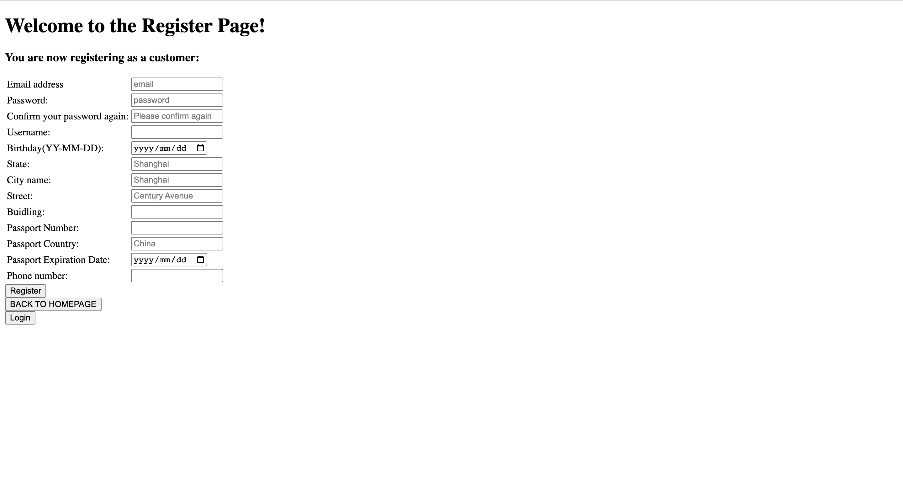
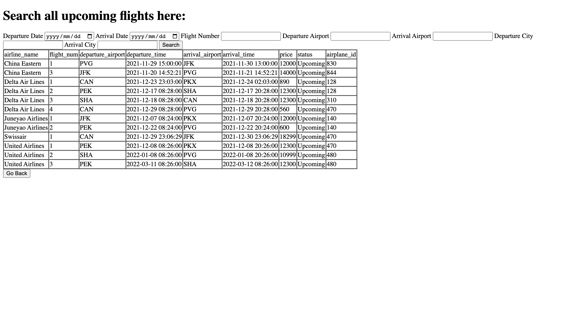
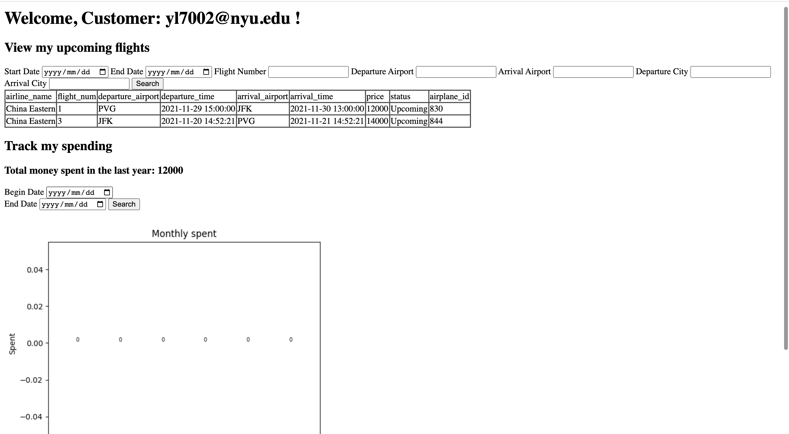
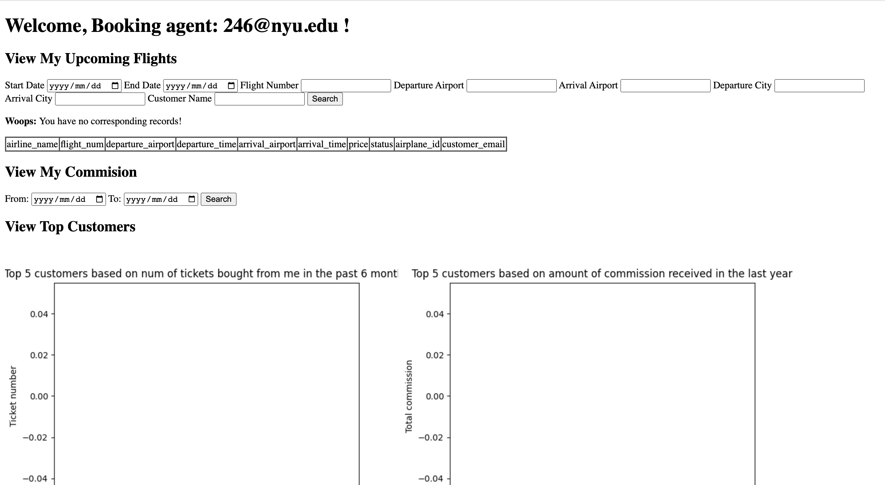

# Airline_management_system
Airline ticket management system for Databases Final Project
Using this system, customers can search for flights,purchase flights ticket,view their upcoming flight status or see their past flights etc. There will be three types of users of this system - Customers, Booking Agents and Airline Staff (Administrator). Booking Agents will book flights for other Customers, can get a fixed commission. They can view their monthly reports and get total commission. Airline Staff will add new airplanes, create new flights, and update flight status.

## Environment
- MySQL (XAMPP is recommended)
- Python 3
- flask
- pymysql

## Team member
[@Han Yixiao](https://github.com/Yttriummm)
- Back-end and front-end for Agent user case

[@Lu Yumeng](https://github.com/Lu-Yumeng)
- Back-end and front-end for Customer and Staff user case

## File outline
- [main_code](/main_code.py): all back-end logic
- [templates](/templates): all front-end html file

## Project Overview
- Login page

- Register page

- Flights Search page

- Customer Homepage

- Booking Agent homepage

## Bonus
- Used hash function before writing password into database
- Used session to preserve user information and prevent  directly accessing a page by entering url

